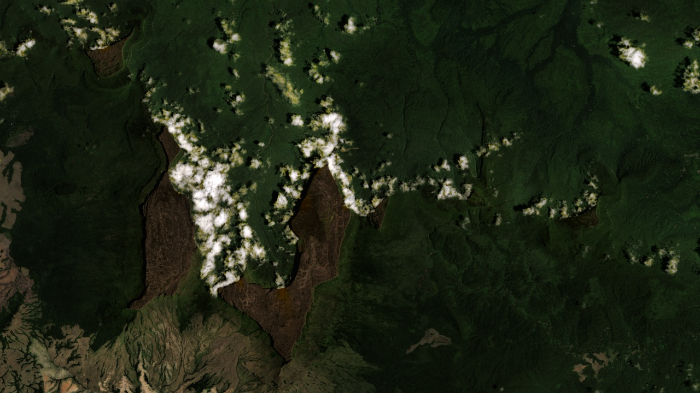
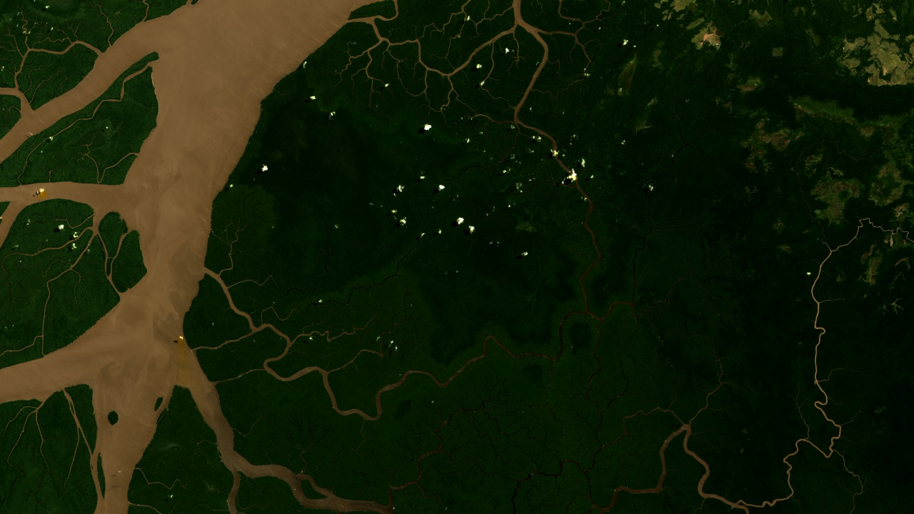
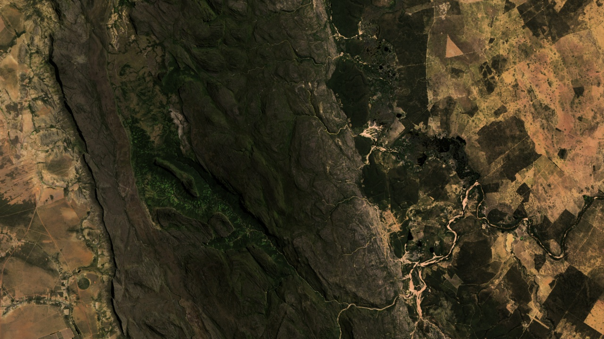
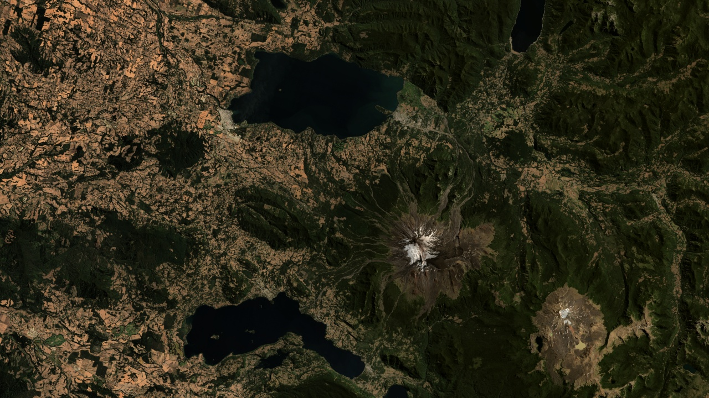
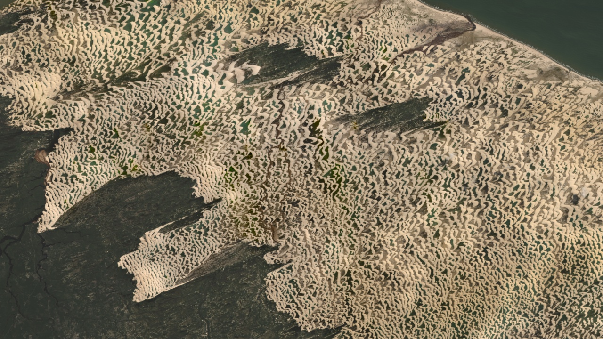

# Landsat Wallpapers

> Beautiful wallpapers made from Landsat remote-sensing data.

Uses [xlandsat](https://www.compgeolab.org/xlandsat/) and public domain data
downloaded from [EarthExplorer](https://earthexplorer.usgs.gov/).

## Wallpapers

**Mount Roraima:** [download 4k](https://github.com/leouieda/landsat-wallpapers/blob/main/wallpapers/roraima.jpg?raw=true) | [download 720p](https://github.com/leouieda/landsat-wallpapers/blob/main/wallpapers/roraima-720p.jpg?raw=true) | [code](https://github.com/leouieda/landsat-wallpapers/blob/main/code/roraima.ipynb)

**Amazon river delta:** [download 4k](https://github.com/leouieda/landsat-wallpapers/blob/main/wallpapers/amazon-delta.jpg?raw=true) | [download 720p](https://github.com/leouieda/landsat-wallpapers/blob/main/wallpapers/amazon-delta-720p.jpg?raw=true) | [code](https://github.com/leouieda/landsat-wallpapers/blob/main/code/amazon-delta.ipynb)

**Vale do Pati:** [download 4k](https://github.com/leouieda/landsat-wallpapers/blob/main/wallpapers/vale-do-pati.jpg?raw=true) | [download 720p](https://github.com/leouieda/landsat-wallpapers/blob/main/wallpapers/vale-do-pati-720p.jpg?raw=true) | [code](https://github.com/leouieda/landsat-wallpapers/blob/main/code/vale-do-pati.ipynb)

**Villarrica volcano:** [download 4k](https://github.com/leouieda/landsat-wallpapers/blob/main/wallpapers/villarrica.jpg?raw=true) | [download 720p](https://github.com/leouieda/landsat-wallpapers/blob/main/wallpapers/villarrica-720p.jpg?raw=true) | [code](https://github.com/leouieda/landsat-wallpapers/blob/main/code/villarrica.ipynb)

**Lençóis Maranhenses:** [download 4k](https://github.com/leouieda/landsat-wallpapers/blob/main/wallpapers/lençóis.jpg?raw=true) | [download 720p](https://github.com/leouieda/landsat-wallpapers/blob/main/wallpapers/lençóis-720p.jpg?raw=true) | [code](https://github.com/leouieda/landsat-wallpapers/blob/main/code/lençóis.ipynb)

## License

Files in the `code` folder are distributed under the MIT license (see
`LICENSE-MIT.txt`).
All other files are distributed under the CC0 license (see `LICENSE-CC0.txt`).
